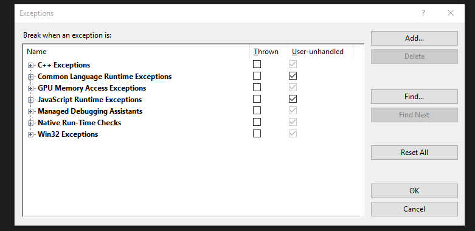

- title : C# 6 and Visual Studio 2015
- description : C# 6 and Visual Studio 2015
- author : Filip Štaffa
- theme : night
- transition : default

***

# C# 6 and Visual Studio 2015
Filip Štaffa

***

## History

---

### Roslyn compiler

---

### Single compiler replacing all existing compilers

---

* csc
* Visual Studio IntelliSense
* Immediate Window

---

### Not a big feature, but several smaller ones

***

## C# 5 example

---

	[lang=cs]
	public class Person
	{
		private readonly int age;
		public int Age { get { return age; }}

		public string FullName { get; private set; }

		public string FirstName { get { FullName == null ? null : FullName.Split(' ').First(); }}

		public Person(string fullName, int age)
		{
			this.age = age;
			this.FullName = fullName;
		}

		public override string ToString()
		{
			return string.Format("Person {0} is {1} years old", FullName, Age);
		}
	}

***

## String interpolation

---

	[lang=cs]
	string.Format("Person {0} is {1} years old", person.Name, person.Age");

#### C# 6
	[lang=cs]
	$"Person {person.Name} is {person.Age} years old";

---

### Specifying culture

	[lang=cs]
	static void Demo()
	{
		// formatting as south african
		var example1 = en_za($"Your balance is {Balance:C}");
	}

	public static string en_za(IFormattable formattable)
	{
		return formattable.ToString(null, new CultureInfo("en-za"));
	}

---

* Is an expression
* Can contain any C# expression
* Validated by compiler
* Allows string formatting
* Ues IFormattable for specifying culture

***

## Get only autoproperties

---

	[lang=cs]
	private readonly int age;
	public int Age { get { return age; }}

	public string FullName { get; private set; }

	public Person(string fullName, int age)
	{
		this.age = age;
		this.FullName = fullName;
	}

---

#### C# 6

	[lang=cs]
	public int Age { get; }

	public string FullName { get; }

	public Person(string fullName, int age)
	{
		Age = age;
		FullName = fullName;
	}

---

* Truly immutable (as oposed to {get; private set; })

***

## Initial values for auto properties

	[lang=cs]
	public ILog Logger { get; set; } = NullLogger.Instance;

***

## Expression-bodied function members

---

	[lang=cs]
	public string FirstName {get { FullName == null ? null : FullName.Split(' ').First(); }}

#### C# 6
	[lang=cs]
	public string FirstName => FullName == null ? null : FullName.Split(' ').First();

---

### Good alternative for constants
	[lang=cs]
	public readonly string DefaultName = "Default";

	public string DefaultName { get { return "Default"; }}

#### C# 6
	[lang=cs]
	public string DefaultName => "Default";

---

### Works for functions

	[lang=cs]
	public class Calcualtor
	{
		public int Add(int a, int b) => a + b;
	}

***

## Null-conditional operator

---

	[lang=cs]
	public string FirstName { get { FullName == null ? null : FullName.Split(' ').First(); }}

#### C# 6
	[lang=cs]
	public string FirstName {get { FullName?.Split(' ').First(); }}

---

### Returns null if target null, otherwise evaluates expression

---

### Useful for delegates and events

	[lang=cs]
	var handler = PropertyChanged;
	if (handler != null)
	{
		handler(this, new PropertyChangedEventArgs("FirstName"));
	}
#### C# 6
	[lang=cs]
	PropertyChanged?.(this, new PropertyChangedEventArgs("FirstName"));

---

### Works in multiple levels chaining
	[lang=cs]
	public string GetParentName(Person person)
	{
		if (person != null)
		{
			var parent = person.Parent;
			if (parent != null)
			{
				return parent.Name;
			}
		}
		return null;
	}
#### C# 6
	[lang=cs]
	public string GetParentName(Person person) => person?.Parent?.Name;

***

### Combined

	[lang=cs]
	public class Person
	{
		private readonly int age;
		public int Age { get { return age; }}

		public string FullName { get; private set; }

		public string FirstName { get { FullName == null ? null : FullName.Split(' ').First(); }}

		public Person(string fullName, int age)
		{
			this.age = age;
			this.FullName = fullName;
		}

		public override string ToString()
		{
			return string.Format("Person {0} is {1} years old", FullName, Age);
		}
	}

---

	[lang=cs]
	public class Person
	{
		public int Age { get; }

		public string FullName { get; }

		public string FirstName => FullName?.Split(' ').First();

		public Person(string fullName, int age)
		{
			Age = age;
			FullName = fullName;
		}

		public override string ToString()
		{
			return $"Person {FullName} is {Age} years old";
		}
	}

***

### Nameof operator

	[lang=cs]
	public PersonRepository(ILog logger)
	{
		if (logger == null)
		{
			throw new ArgumentException(nameof(logger));
		}
	}

***

### Static

	[lang=cs]
	using static System.Console;
	using static System.Math;
	using static System.DayOfWeek;
	class Program
	{
		static void Main()
		{
			WriteLine(Sqrt(3*3 + 4*4)); 
			WriteLine(Friday - Monday); 
		}
	}

***

### Await in catch and finally blocks

	[lang=cs]
	Resource res = null;
	try
	{
		res = await Resource.OpenAsync(…);       // You could do this.
		…
	} 
	catch(ResourceException e)
	{
		await Resource.LogAsync(res, e);         // Now you can do this …
	}
	finally
	{
		if (res != null) await res.CloseAsync(); // … and this.
	}

***

### Exception filters

	[lang=cs]
	try { … }
	catch (MyException e) when (Myfilter(e))
	{
		…
	}

* Already available in Visual Basic and F#
* Enters catch block only if MyFilter(e) returns true
* Can be abused for logging

***

### Index initializers

	[lang=cs]
	var numbers = new Dictionary<int, string>
	{
		{7 ,"seven"},
		{9, "nine"},
		{13, "thirteen"}
	}

#### C# 6

	[lang=cs]
	var numbers = new Dictionary<int, string>
	{
		[7] = "seven",
		[9] = "nine",
		[13] = "thirteen"
	};

---

* Old version uses Add method
* C# 6 version uses index access (can add same element twice to override value)

---

#### Throws
	[lang=cs]
	var numbers = new Dictionary<int, string>
	{
		{7 ,"seven"},
		{7, "nine"},
		{13, "thirteen"}
	}

#### Works (overwrites "seven" with "nine")

	[lang=cs]
	var numbers = new Dictionary<int, string>
	{
		[7] = "seven",
		[7] = "nine",
		[13] = "thirteen"
	};

***

## Visual Studio 2015

---

### Roslyn

* Code analyzers
* Not that useful with Resharper

***

### Web development

* NPM
* Grunt
* Editors
* Support for DNX

***

### Multi platform development

* more portable library configurations
* Xamarin Starter

***

### Exceptions dialogue 

---

### Modal previously

---

### Non modal and searchable

***

### Code Lens

---

---

* Available previously only for Visual Studio Ultimate
* For VS 2015 available for Professional and Enterprise

***

## Getting stared

---

### Try yout project in VS 2015

* Solutions are compatible
* Some people can work in 2013 and other in 2015
* If you don't plan to upgrade to C# 6, set language level for each project to 5
  * Otherwise R# generages C# 6 code and offers fixes

---

### Test you build configurations

* Create branch with C# 6 code
* Update your build configurations to require MSBUILD 14

***

## References
* [Github roslyn repository](https://github.com/dotnet/roslyn/wiki/New-Language-Features-in-C%23-6)
* [John Skeet's blog](http://codeblog.jonskeet.uk/2014/12/08/c-6-in-action/)
* [Video - Mads Torgerson about C# 6 and 7](https://channel9.msdn.com/Blogs/Seth-Juarez/Looking-Ahead-to-C-7-with-Mads-Torgersen)
* [Visual Studio 2015 release notes](https://www.visualstudio.com/en-us/news/vs2015-vs.aspx#Debug)

***

# Questions
